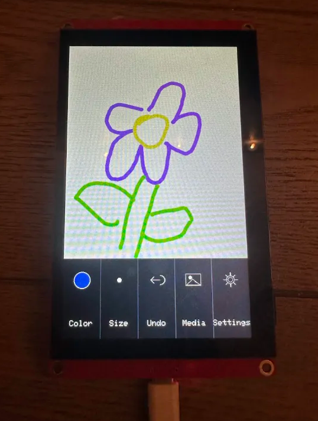
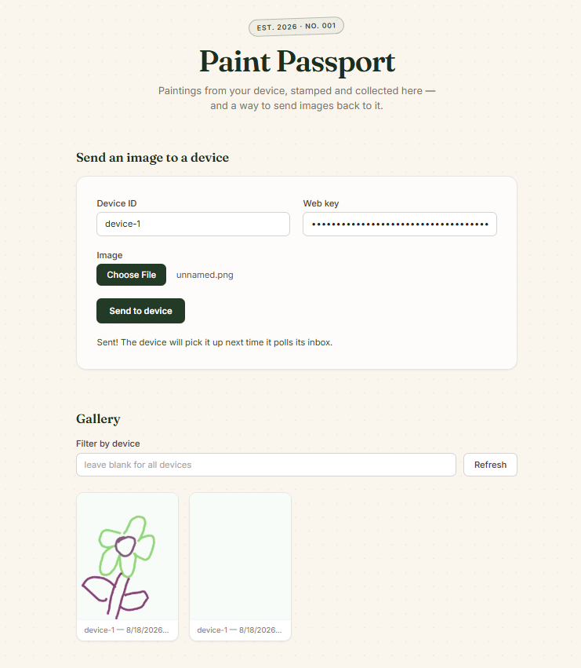

# Paint Passport

A handheld painting device (ESP32-S3 touchscreen) that saves paintings locally, sends them to a
cloud gallery you can view in any browser, and can receive photos sent back from that web page
onto the device.

|  |  |
|---|---|
|  |  |
| The device | The web gallery |

## Tech stack

**Firmware** (`firmware/esp32_client/`) - C++ / Arduino framework on an ESP32-S3.
- [LovyanGFX](https://github.com/lovyan03/LovyanGFX) drives the 480×800 parallel-RGB display and
  GT911 touch controller.
- Paintings are stored on an SD card as raw 24-bit BMPs.
- WiFi via the ESP32's built-in radio; HTTPS via `WiFiClientSecure` / `HTTPClient`
  (`setInsecure()` - no cert pinning).
- No RTOS framework beyond Arduino's own loop; the whole app is a single hand-rolled
  touch-driven state machine.

**Cloud backend** (`infra/`) - fully serverless AWS, defined as infrastructure-as-code with the
**AWS CDK** (TypeScript).
- **S3** - stores painting/photo images and hosts the static web gallery.
- **DynamoDB** (on-demand billing) - one table for saved paintings, one for each device's inbox.
- **API Gateway** (HTTP API) - presign/list/inbox/ack routes, in front of the Lambdas.
- **Lambda** - six small Node.js 20 functions (bundled with esbuild) for the API routes, plus one
  Python 3.12 function packaged as a container image, using **Pillow** to resize/crop/convert
  incoming web photos into the exact BMP format the device reads.
- Auth is a simple shared-secret scheme (`x-device-key` / `x-web-key` headers) - no Cognito/IAM,
  deliberately minimal for a personal, two-device project.

**Web gallery** (`web/`) - static HTML/CSS/JS, no build step, styled with **Tailwind CSS** via
CDN, hosted directly from an S3 bucket.

## How it works

**Device → web gallery:** draw a painting, hit SAVE (auto-uploads if WiFi is connected), or tap
the upload icon on any already-saved painting later. The device asks the API for a presigned S3
URL and streams the BMP straight from the SD card. An S3 event fires a Lambda that records it in
DynamoDB; the web page lists it via a presigned GET URL.

**Web → device:** upload a photo on the web page. It goes to S3 via a presigned URL, which
triggers the Pillow Lambda to crop/resize it to the device's 480×600 canvas and write a
device-native BMP, plus an inbox record in DynamoDB. The device polls its inbox roughly every 30
seconds while idle (not mid-stroke, no panel open) and downloads anything waiting, filing it under
the **Received** tab in the on-device gallery so it never overwrites a painting in progress.

## Repo layout

```
firmware/esp32_client/   Arduino sketch (the device)
infra/                   AWS CDK app + Lambda source
web/                     Static web gallery
```

## Setup

### 1. Cloud backend

Prerequisites: Node.js 20+, Docker Desktop (running - the Pillow Lambda builds as a container
image), an AWS account with an IAM user for deploying, AWS CLI v2 (`aws configure`).

```
cd infra
cp config.example.json config.json     # fill in random secrets (openssl rand -hex 32),
                                        # one per device plus one web key - gitignored, never commit
npm install
npx cdk bootstrap        # one-time per AWS account + region
npx cdk deploy
```

Note the `ApiUrl` and `WebUrl` it prints at the end.

```
cd ../web
cp config.example.js config.js         # set apiUrl to the ApiUrl output - gitignored
cd ../infra
npx cdk deploy                         # redeploy so the web bucket picks up config.js
```

Open `WebUrl` in a browser - the gallery works once a device has uploaded something.

### 2. Firmware

Arduino IDE, board package **ESP32 by Espressif Systems**, board **ESP32S3 Dev Module**.

| Setting | Value |
|---|---|
| PSRAM | OPI PSRAM *(8MB embedded PSRAM is OPI/octal despite quad flash)* |
| Flash Size | 4MB (32Mb) |
| Flash Mode | QIO 80MHz |
| Partition Scheme | Default 4MB with spiffs (1.2MB APP / 1.5MB SPIFFS) |
| USB CDC On Boot | Disabled |
| Upload Speed | 921600 |

Cloud secrets (gitignored, per device):

```
cd firmware/esp32_client
cp cloud_secrets.example.h cloud_secrets.h
```

Fill in `CLOUD_API_BASE` (the `ApiUrl` output), `CLOUD_DEVICE_ID`, and `CLOUD_DEVICE_KEY`
(matching an entry in `infra/config.json`). Flash a second device with its own ID/key pair rather
than reusing the first one's.

### 3. Try it

```
curl -X POST "$API_URL/devices/device-1/paintings/presign" -H "x-device-key: <secret>"
```

PUT any BMP to the returned `uploadUrl` and refresh the web gallery - it should show up within a
second or two.

## Cost & cleanup

Everything is pay-per-use (S3, Lambda, DynamoDB on-demand, API Gateway HTTP API) - pennies a month
at personal-project traffic. `cd infra && npx cdk destroy` tears the stack down; `MediaBucket`,
`PaintingsTable`, and `InboxTable` are set to `RETAIN` so your paintings survive a destroy, and
need deleting manually from the console if you actually want them gone.

## Status / known issues

- Core round trip (save, auto/manual upload, receive) works end to end.
- **Open bug:** colors come out wrong after any save/load or cloud round trip - confirmed in both
  directions (a device-drawn painting looks wrong once viewed in the browser, and a downloaded
  photo looks wrong on the device). Under active investigation.
- **Not yet built:** live two-device mirroring/drawing mode (would use AWS IoT Core / MQTT).
